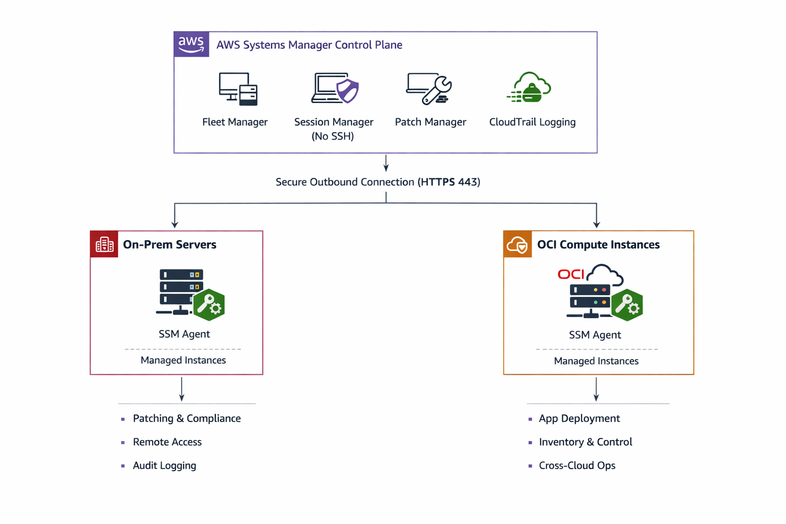

## Hybrid Governance Architecture

## Featured Enterprise Case Studies (Regulated Environments)

This repository includes real-world enterprise case studies demonstrating governance-first cloud operations:

- **Hybrid Governance with AWS Systems Manager (On-Prem + AWS)**
  Securely managing on-prem infrastructure using AWS SSM with centralized audit logging.
  → `docs/case-studies/hybrid-ssm-onprem.md`

- **Compliance Audit Remediation in CI/CD (Jenkins + AWS CodeDeploy)**
  Redesigning CI/CD workflows after internal audit findings to meet strict source code governance policies.
  → `docs/case-studies/compliance-cicd-audit-remediation.md`

- **Cross-Cloud Operations: OCI Compute Managed via AWS SSM**
  Extending AWS SSM as a unified control plane to manage OCI workloads and deploy applications securely.
  → `docs/case-studies/aws-ssm-oci-control-plane.md`
